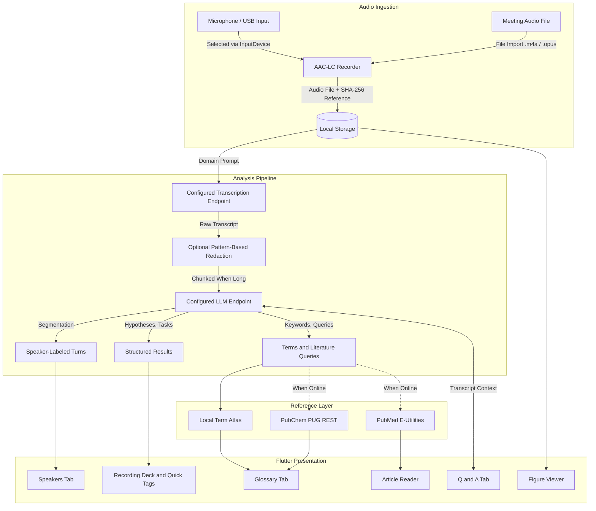

# LabScribe AI — Scientific Meeting & Research Companion

[](https://github.com/Nurulamin6191/LabScribe-AI/releases)
[](#-download-standalone-installers)
[](LICENSE)

**LabScribe AI** is a cross-platform companion for lab seminars, journal clubs, tumor boards, and thesis defenses. It records audio, produces transcripts via a configurable transcription endpoint, organizes summaries, bench tasks, speaker-labeled turns, and literature references, and supports export to Markdown, ELN JSON, and BibTeX.

> Scope note: outputs are model-generated and heuristic. Verify gene names, doses, statistics, speaker labels, and citations before using them in protocols, manuscripts, or clinical documentation.

---

## Download Standalone Installers

No Flutter, Git, or command-line setup required for the packaged builds:

| Operating System | Standalone Package | How to Install |
| :--- | :--- | :--- |
| **Android Phone / Tablet** | [**LabScribe-AI-Universal.apk**](https://github.com/Nurulamin6191/LabScribe-AI/releases/latest) | Tap to install |
| **Linux (Ubuntu / Debian / Mint)** | [**labscribe_1.0.0_amd64.deb**](https://github.com/Nurulamin6191/LabScribe-AI/releases/latest) | Double-click to install (adds desktop entry) |
| **Windows 10 / 11 (64-bit)** | [**LabScribe-AI-Windows-x64.zip**](https://github.com/Nurulamin6191/LabScribe-AI/releases/latest) | Extract and run `labscribe.exe` |

---

## Key Features

- **Speaker-labeled turns**: groups transcript segments by detected speaker flow, with manual rename that updates turns and task attributions, plus tap-to-seek playback where audio is available.
- **Call audio import**: import existing recordings (`.m4a`, `.mp3`, `.wav`, `.opus`) from conferencing tools for transcription and analysis. Loopback/monitor capture depends on OS audio setup.
- **Long-audio handling**: files above the transcription payload limit are processed in sequential chunks with rolling context.
- **Redaction helper**: optional pattern-based masking for common identifier formats (e.g. MRN-like labels, DOB-like phrases, phone/email patterns). Review output before sharing. This is not a certification of de-identification.
- **Biomedical transcription prompts**: transcription requests include a domain vocabulary prompt covering genes, therapeutics, assays, and statistics. Verify casing and terms in the transcript editor.
- **Reference hashes**: SHA-256 hashes for audio files and transcript text are stored with the session and included in exports for reference. This is not a compliance certification.
- **Noise controls**: uses platform noise suppression, echo cancellation, and auto-gain options exposed by the recorder plugin where supported.
- **Bibliography export (.bib)**: formats saved citations for reference managers and LaTeX.
- **Notebook and ELN export**: generates Markdown notes and structured JSON for ELN import.
- **Long-transcript summarization**: transcripts above ~5,000 words are summarized in overlapping sections before a final synthesis.

---

## Meeting Workflow Support

| Capability | Implementation | Notes |
| :--- | :--- | :--- |
| **Speaker turns** | Dialogue-flow segmentation + editable labels | Verify labels before export |
| **Call import** | File picker for `.m4a`/`.opus`/etc. | Depends on files exported by meeting apps |
| **Compact dock** | Narrow card layout toggled from the AppBar | Useful alongside slides or meeting windows |
| **Quick tags** | `Action Item`, `Hypothesis`, `Result`, `Question` bookmarks | Timestamped to the recording timer |
| **Exit confirm** | `PopScope` guard during active recording | Helps avoid accidental navigation |
| **Microphone selection** | `AudioRecorder.listInputDevices()` | Device list depends on OS permissions |
| **Live notes stream** | Chronological list in the recording deck | Stored with the session |
| **Responsive layout** | Desktop: rail + deck + content; Mobile: bottom bar | See `recorder_view.dart` |

---

## In-App Reference Tools

These reduce context switching; network features require connectivity:

1. **PubMed reader**:
   - Queries NCBI E-Utilities (`esearch`, `esummary`).
   - Shows title, authors, journal, DOI, PMID, and available abstract text in-app.
   - Copies a short citation string.
2. **Built-in term atlas**:
   - Local map of selected oncology drugs, genes, assays, and statistics terms.
   - Used before network lookups; edit entries in `public_api_service.dart`.
3. **PubChem and PubMed search**:
   - Search bar for compounds/genes and papers/PMIDs during review.
4. **Figure viewer**:
   - `InteractiveViewer` pinch-to-zoom for attached images.
5. **Markdown preview**:
   - `MarkdownBody` preview of the generated notebook before export.

---

## Architecture



---

## Getting real results with zero setup

No API keys, no terminal, no URLs needed for the default path:

1. **Live transcription (on-device)** — open the Record tab, switch to
   **Live** mode, and press the green button. Your device transcribes as
   you speak (Android / iOS / Windows / macOS; hidden on Linux, which the
   plugin does not support). The transcript always matches your meeting
   because it *is* your meeting.
2. **One-tap analysis** — press **Process AI insights**. Summaries, tasks,
   glossary, and Q&A run on a keyless hosted model by default.
3. **Recorded audio files** (uploads to Whisper-style endpoints) remain
   available in **Record** mode for setups with a configured endpoint.

Until transcription is configured, audio-file analysis runs only on
explicitly chosen sample data, which is always labeled as such.
See `docs/PIPELINE.md` for source priority and honesty rules.

## Local AI Engine Setup (optional, for audio-file uploads)

```bash
chmod +x scripts/setup_local_ai.sh
./scripts/setup_local_ai.sh
```

### Example Model Options

| Option | Model | Notes |
| :--- | :--- | :--- |
| **Local 7B** | `qwen2.5:7b` | General reasoning; needs a machine with sufficient RAM/VRAM |
| **Biomedical-tuned 7B** | `biomistral:7b` | PubMed-oriented tuning per its model card |
| **Smaller local** | `qwen2.5:3b` / `qwen2.5:1.5b` | Lower resource use; reduced capacity |
| **STT example** | `faster-whisper-large-v3-turbo` | Runs via a compatible transcription server |

Throughput and accuracy vary by hardware, quantization, and server version. Measure on your setup.

Configure endpoints in **Settings** in the app:
- **Transcription Endpoint**: e.g. `http://localhost:8000` or a compatible API
- **LLM Endpoint**: e.g. `http://localhost:11434` (Ollama) or `http://localhost:8000` (vLLM)

The recording deck shows red/amber/green reachability dots for both
endpoints (tap **Test**). Until transcription is configured, analysis runs
only on explicitly chosen sample data, which is always labeled as such.
See `docs/PIPELINE.md` for source priority and honesty rules.

---

## Build Instructions

### 1. Android Package (`.apk`)

```bash
flutter build apk --release --split-per-abi

# build/app/outputs/flutter-apk/app-arm64-v8a-release.apk
# build/app/outputs/flutter-apk/app-armeabi-v7a-release.apk
# build/app/outputs/flutter-apk/app-x86_64-release.apk
```

### 2. Linux Debian Package (`.deb`)

```bash
./packaging/linux/build_deb.sh

# Install:
sudo dpkg -i labscribe_1.0.0_amd64.deb
labscribe
```

### 3. Windows Native Executable (`.exe`)

```powershell
flutter build windows --release
# Output folder: build\windows\x64\runner\Release\
```

---

## Public APIs Integration Details

Conforming to the [public-apis/public-apis](https://github.com/public-apis/public-apis) index:

1. **NCBI PubMed E-Utilities API** (`Category: Science & Math`):
   - Endpoints: `https://eutils.ncbi.nlm.nih.gov/entrez/eutils/esearch.fcgi` and `esummary.fcgi`
   - Used for literature search and summaries. Requests are rate-limited in-app (350ms delay between calls).
2. **NIH PubChem PUG REST API** (`Category: Science & Math`):
   - Endpoint: `https://pubchem.ncbi.nlm.nih.gov/rest/pug/compound/name/{name}/description/JSON`
   - Used for compound descriptions and CIDs.
3. **Free Dictionary API** (`Category: Dictionaries`):
   - Endpoint: `https://api.dictionaryapi.dev/api/v2/entries/en/{word}`
   - Used for general academic terms when the local atlas has no entry.
4. **LibreTranslate API** (`Category: Translation`):
   - Endpoint: configurable; defaults to `https://libretranslate.com/translate`
   - Used for transcript/summary translation. Requires a reachable instance.

---

## Limitations

- Transcription quality depends on audio quality, overlapping speech, accents, and the configured model.
- Speaker labels are inferred from dialogue flow, not voice biometrics.
- Redaction uses regular expressions and can miss or over-mask text. Always review before sharing.
- PubMed/PubChem results depend on network availability and upstream API changes.
- SHA-256 values are integrity references, not proof of regulatory compliance.

---

## License

Distributed under the Apache 2.0 License. See `LICENSE` for details.
