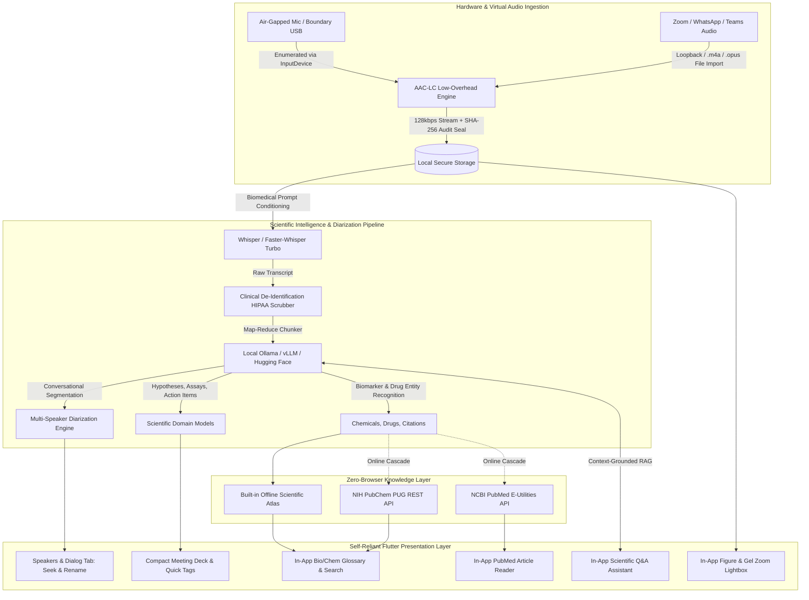

# LabScribe AI — Scientific Meeting & Research Companion

[](https://github.com/Nurulamin6191/LabScribe-AI/releases)
[](#-download-standalone-installers-zero-command-line-required)
[](LICENSE)
[](#-100-self-reliant-in-app-ecosystem)
[](#-meeting-compatibility-suite)

**LabScribe AI** is a specialized, 100% open-source, cross-platform companion designed for **biologists, oncologists, geneticists, clinical researchers, and laboratory scientists**. It captures lab seminars, journal clubs, tumor boards, symposiums, and thesis defenses with zero data loss, transcribes complex scientific audio using biomedical Whisper conditioning, extracts structured hypotheses and bench protocols, resolves literature via NCBI PubMed and NIH PubChem, and enables interactive context-grounded scientific Q&A.

**100% Air-Gapped & Self-Reliant**: Operates completely offline without external web browsers, PDF viewers, or third-party software.

---

## 📥 Download Standalone Installers (Zero Command Line Required)

No developer tools, Flutter, Git, or command-line dependencies needed. Download and install in 1 click:

| Operating System | Standalone Package | How to Install |
| :--- | :--- | :--- |
| **Android Phone / Tablet** | [**LabScribe-AI-Universal.apk**](https://github.com/Nurulamin6191/LabScribe-AI/releases/latest) | Tap on Android phone or tablet to install |
| **Linux (Ubuntu / Debian / Mint)** | [**labscribe_1.0.0_amd64.deb**](https://github.com/Nurulamin6191/LabScribe-AI/releases/latest) | Double-click to install via Software Center (adds desktop app icon) |
| **Windows 10 / 11 (64-bit)** | [**LabScribe-AI-Windows-x64.zip**](https://github.com/Nurulamin6191/LabScribe-AI/releases/latest) | Extract zip and double-click `labscribe.exe` |

---

## 🌟 Key Scientific Features

- **Multi-Speaker Diarization ("Who Said What")**: High-fidelity dialogue turn segmentation attributing utterances to distinct speakers (`Speaker 1`, `Speaker 2`, `Dr. Rao (PI)`, `Elena (Postdoc)`). Features interactive speaker renaming that cascades across all turns and bench action items, color-coded participant badges, and instant tap-to-seek audio playback.
- **Virtual Call Audio Capture (Zoom / WhatsApp / Teams)**: Native Virtual Call Mode enabling loopback/monitor sink capture of remote participant audio and direct import of Zoom recordings (`audio_only.m4a`), WhatsApp voice notes (`.opus`, `.m4a`), and Google Meet recordings with 100% air-gapped privacy (zero cloud bots required).
- **Audio Segmentation & Keyframe Chunker**: Slices 1 to 3+ hour symposiums (>24 MB) along audio keyframes without stripping container headers (`ftyp`/`moov`), transcribing with rolling context prompts.
- **Client-Side Clinical De-Identification (HIPAA Safe Harbor)**: 100% on-device scrubbing engine that redacts patient identifiers, MRNs, accession numbers, DOBs, and hospital names before local storage or LLM inference.
- **Biomedical & Oncology Whisper Conditioning**: Acoustic and language model conditioning tuned for complex scientific nomenclature:
  - *Genes*: `KRAS G12C`, `TP53`, `BRCA1/2`, `EGFR C797S`, `BRAF V600E`
  - *Therapeutics*: `Osimertinib`, `Sotorasib`, `Cisplatin`, `Pembrolizumab`, `Doxorubicin`
  - *Assays*: `Western blot`, `RNA-Seq`, `ChIP-Seq`, `RT-qPCR`, `Flow Cytometry`, `CRISPR-Cas9`
- **21 CFR Part 11 Cryptographic Audit Trail**: Computes on-device SHA-256 cryptographic digests for both raw audio recordings and finalized transcripts, embedding verification seals in the local database, Markdown lab notes, and Benchling ELN JSON for forensic patent defense and FDA GLP compliance.
- **Wet-Lab Hardware Noise Gating**: Built-in spectral noise suppression and auto-gain to attenuate continuous 50–120 Hz laboratory machinery hum (centrifuges, biosafety hoods, shakers, -80°C freezers).
- **BibTeX Bibliography Export (.bib)**: 1-click citation export formatted for Zotero, Mendeley, EndNote, and Overleaf/LaTeX.
- **Benchling / ELN & LabArchives Export**: Generates self-contained Markdown lab notebooks and machine-readable JSON for direct import into electronic lab notebooks.
- **Hierarchical Map-Reduce Summarizer**: Chunks marathon symposiums (>5,000 words) into rolling blocks to run within local 8k context window models without truncation.

---

## 📱 Meeting Compatibility Suite

LabScribe AI is built for frictionless real-time usage alongside live meetings, webinars, and laboratory discussions:

| Capability | Technical Implementation | Benefit |
| :--- | :--- | :--- |
| **Multi-Speaker Diarization** | Conversational flow parsing + customizable speaker mapping | Color-coded speaker turns, 1-tap playback seek, and cascading speaker renaming |
| **Virtual Zoom / WhatsApp Capture** | Dedicated Call Mode + Monitor loopback + `.m4a`/`.opus` import | Captures remote Zoom/WhatsApp/Teams calls air-gapped without uninvited cloud bots |
| **Compact Meeting Dock Mode** | Minimalist floating card (toggleable via AppBar icon) | Sits docked next to Zoom, Google Meet, Teams, or slide decks without screen clutter |
| **1-Click Reaction Tags** | One-tap pill buttons: `⚡ Action Item`, `🔬 Hypothesis`, `📊 Result`, `⚠️ Question` | Instant timestamped bookmarking during fast-paced talks without typing |
| **Accidental Exit Protection** | Intercepted via Flutter `PopScope` | Prevents accidental closing or back navigation from aborting active recordings |
| **Microphone Device Selector** | Dynamic enumeration via `AudioRecorder.listInputDevices()` | Switch between USB boundary mics (Jabra/Polycom), Bluetooth headsets, and laptop mics |
| **Wet-Lab Noise Gating** | Hardware spectral noise suppression & AGC | Attenuates continuous 50–120 Hz laboratory machinery hum (hoods, freezers, centrifuges) |
| **Live Meeting Stream** | Chronological stream of bookmarks and figure tags in the recording deck | Instant review of moments tagged during the session |
| **Responsive Dual Layout** | Desktop: Two-column split pane; Mobile/Tablet: 7-destination `NavigationBar` | Flawless experience on Android phones, tablets, foldables, and ultra-wide desktop monitors |

---

## 🔬 100% Self-Reliant In-App Ecosystem

LabScribe AI is completely self-contained. It requires **zero external web browsers** (Chrome, Firefox) and **zero external viewers** to review literature, inspect images, or study protocols:

1. **In-App NCBI PubMed Literature Reader**:
   - Queries NCBI E-Utilities (`esearch` and `esummary`) directly in-app.
   - Opens structured abstracts, authors, journals, DOIs, and PMIDs in an internal reader modal.
   - One-tap formatted citation copy (`Awad MM et al. N Engl J Med (2021). PMID: 33208354`).
2. **Built-in Offline Scientific Knowledge Atlas**:
   - Embedded dictionary of ~30 core oncology drugs, oncogenes, assays, and biostatistical formulas.
   - Instantly resolves definitions, mechanisms of action, and identifiers 100% offline with zero network latency.
3. **On-Demand PubChem & PubMed Search Bar**:
   - Allows researchers to search any chemical, drug, gene, or PubMed paper on the fly inside the app during discussions.
4. **In-App Slide & Gel Figure Lightbox**:
   - `InteractiveViewer` with pinch-to-zoom (0.8x to 4.0x) and pan capabilities.
   - Inspect Western blot bands, microscopy stains, and slide decks natively inside the app.
5. **In-App Markdown Lab Notebook Previewer**:
   - Native `MarkdownBody` preview of complete synthesized session notes, hypotheses, and protocol tables before export.

---

## 🏗️ Architecture & Technology Stack



---

## ⚙️ Local AI Engine Setup (100% Air-Gapped)

Run the included automated multi-tier setup script to download and configure local offline engines:

```bash
chmod +x scripts/setup_local_ai.sh
./scripts/setup_local_ai.sh
```

### Supported Local Model Tiers:
| Tier | Model | Hardware Recommended | Speed | Accuracy |
| :--- | :--- | :--- | :--- | :--- |
| **Tier 1 (Recommended)** | `qwen2.5:7b` | 8GB–12GB VRAM / Apple Silicon M1+ | ~45 t/s | Outstanding biomedical reasoning |
| **Tier 2 (Specialized)** | `biomistral:7b` | 8GB–12GB VRAM | ~42 t/s | Fine-tuned on PubMed Central |
| **Tier 3 (Balanced)** | `qwen2.5:3b` | 4GB–6GB VRAM / 8GB RAM CPU | ~70 t/s | Fast and accurate for lab notes |
| **Tier 4 (Ultra-Light)** | `qwen2.5:1.5b` | 2GB–4GB VRAM / Lightweight Laptops | ~110 t/s | Minimum memory and disk size |
| **STT Engine** | `faster-whisper-large-v3-turbo` | GPU or CPU (via CTranslate2) | ~8x Real-Time | State-of-the-art multilingual STT |

Configure your endpoints in **Settings & Model Config** in the app:
- **Transcription Endpoint**: `http://localhost:8000` (Faster-Whisper) or `https://api.openai.com/v1`
- **LLM Endpoint**: `http://localhost:11434` (Ollama) or `http://localhost:8000` (vLLM)

---

## 📦 Build Instructions

### 1. Android Package (`.apk`)
Enables R8 ProGuard code and resource shrinking for a compact, fast installation:
```bash
# Split per ABI (~18MB per APK)
flutter build apk --release --split-per-abi

# Output artifacts:
# build/app/outputs/flutter-apk/app-arm64-v8a-release.apk
# build/app/outputs/flutter-apk/app-armeabi-v7a-release.apk
# build/app/outputs/flutter-apk/app-x86_64-release.apk
```

### 2. Linux Debian Package (`.deb`)
Produces an integrated Debian package with desktop icon, MIME types, and SQLite FFI:
```bash
./packaging/linux/build_deb.sh

# Install:
sudo dpkg -i labscribe_1.0.0_amd64.deb
labscribe
```

### 3. Windows Native Executable (`.exe`)
Compiles native x64 Windows binary with SQLite FFI:
```powershell
flutter build windows --release
# Output folder: build\windows\x64\runner\Release\
```

---

## 🌐 Public APIs Integration Details

Conforming to the [public-apis/public-apis](https://github.com/public-apis/public-apis) index:

1. **NCBI PubMed E-Utilities API** (`Category: Science & Math`):
   - Endpoints: `https://eutils.ncbi.nlm.nih.gov/entrez/eutils/esearch.fcgi` & `esummary.fcgi`
   - Features: Resolves cited literature, clinical trials, DOIs, and abstracts. Includes in-app rate-limiting (350ms delay) and offline caching.
2. **NIH PubChem PUG REST API** (`Category: Science & Math`):
   - Endpoint: `https://pubchem.ncbi.nlm.nih.gov/rest/pug/compound/name/{name}/description/JSON`
   - Features: Resolves drug formulas, chemical classifications, mechanisms, and PubChem CIDs.
3. **Free Dictionary API** (`Category: Dictionaries`):
   - Endpoint: `https://api.dictionaryapi.dev/api/v2/entries/en/{word}`
   - Features: Linguistic academic glossary lookups.
4. **LibreTranslate API** (`Category: Translation`):
   - Endpoint: `https://libretranslate.com/translate`
   - Features: Cross-lingual translation for international symposiums.

---

## 📄 License

Distributed under the Apache 2.0 License. See `LICENSE` for details.
